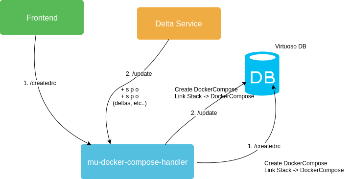

# mu-docker-compose-handler

Microservice to download the docker-compose.yml from a given repository's URL and store it in a graph database. It will
create the DockerCompose model and link the current Stack to it. There are two entry points of this service:

1. **/createdrc**: In a scenario without a delta service, the frontend can call the service directly.
    * method: POST
    * payload: { 'uuid': `<uuid>` }
2. **/update**: This is the entrypoint for updates coming from the delta service. In order for the delta service to call
this entrypoint we will need to edit the *subscribers.json* file like this:

```json
{
  "potentials": [
  ],
  "effectives": [
    "http://drc-handler/update"
  ]
}
```  

# Workflow Diagram



# Quick start

```python
docker run -it --rm \
    --link database:some_container \
    -v /var/run/docker.sock:/var/run/docker.sock \
    mu-docker-compose-handler
Overrides
```

The default graph can be overridden by passing the environment variable MU_APPLICATION_GRAPH to the container.
The default SPARQL endpoint can be overridden by passing the environment variable MU_SPARQL_ENDPOINT to the container.

# Usage

Add the image to the docker-compose.yml file:

```
  drc-handler:
    build: ./mu-docker-compose-handler
    depends_on:
      - database
    links:
      - database:database
```

And add links to the dispatcher & delta service to it.
